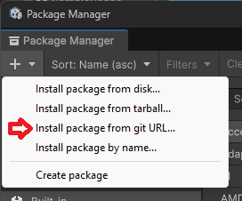
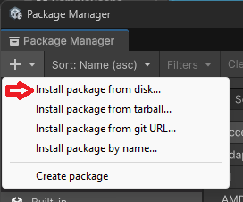
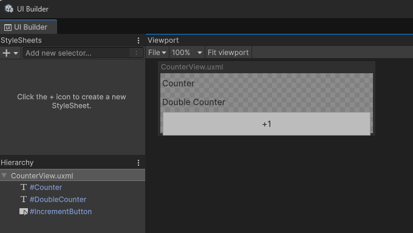
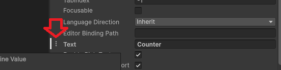
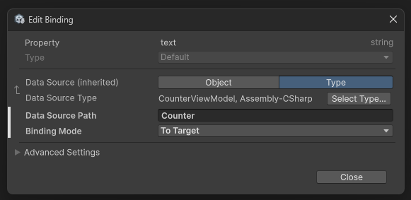
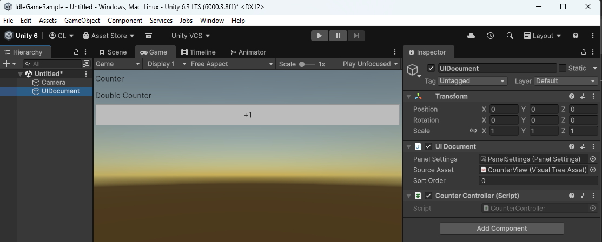

# IdleHelpers Quick Start

`idle-helpers` is a lightweight framework for Unity designed to simplify UI development using UI Toolkit (UIElements) and Data Binding. It helps you decouple your UI logic from your Unity Components using a ViewModel-based approach.

## Installation

You can add IdleHelpers to your Unity project using one of the following methods:

### Method 1: Unity Package Manager (Recommended)



1. Open the **Package Manager** in Unity (`Window > Package Manager`).
2. Click the **+** icon in the top-left corner.
3. Select **Install package from git URL...**.
4. Paste the repository URL: `https://github.com/lpfd/idle-helpers.git`

### Method 2: Manual Clone

1. Clone the repository into your project's `Packages` or `Assets` folder:
```bash
git clone https://github.com/lpfd/idle-helpers.git
```



2. If cloned outside the project, use the Package Manager to **Install package from disk...** and select the `package.json` file.

---

## Quick Start Guide

This guide demonstrates how to create a simple counter UI where a label updates when a button is clicked.

### 1. Create the UI Document

1. Create a new **UI Document (UXML)** file named `CounterView.uxml`.
2. Open it in the UI Builder and add:
* A **Label** with the Name: `Counter`.
* A **Label** with the Name: `DoubleCounter`.
* A **Button** with the Name: `IncrementButton` and text "+1".



3. Add the UXML file to a **UI Document** component on a GameObject in your scene.

### 2. Create the View Model

Create a C# class `CounterViewModel`. This class holds your data and logic.

```csharp
using Leap.Forward.IdleHelpers;
using System.ComponentModel;

[IdleViewModel]
public partial class CounterViewModel: INotifyPropertyChanged
{
    [IdleProperty]
    private int _counter = 0;

    [IdleProperty]
    private int _doubleCounter = 0;

    public event PropertyChangedEventHandler PropertyChanged;

    [ClickHandler("IncrementButton")]
    public void IncrementCounter()
    {
        Counter++;
    }

    [PropertyUpdater]
    void UpdateDoubleCounter()
    {
        DoubleCounter = Counter * 2;
    }

    protected void OnPropertyChanged(string propertyName)
    {
        PropertyChanged?.Invoke(this, new PropertyChangedEventArgs(propertyName));
    }
}
```

### 3. Create the Controller

Create a Unity Component to bridge the UI Document and your ViewModel.

```csharp
using UnityEngine;
using UnityEngine.UIElements;

[RequireComponent(typeof(UIDocument))]
public class CounterController : MonoBehaviour
{
    private CounterViewModel _viewModel;
    private UIDocument _uiDocument;

    void OnEnable()
    {
        _viewModel = new CounterViewModel();
        _uiDocument = GetComponent<UIDocument>();

        _viewModel.BindTo(_uiDocument);
    }
}
```

### 4. Bind labels to View Model

Click on a little triple dot button next to the Text property in the label and add binding.



Setup binding to the Counter property of the View Model class.



Do the same thing for the DoubleCounter.

### 5. Setup scene

Make a game object with UIDocument and CounterController components. Attach document and panel settings to the UIDocument.



### How it works


* **`IdleProperty`**: When the `Counter` value changes, it automatically notifies the UI to update the label.
* **`ClickHandler`**: Links the Buttons in your `UIDocument` to the logic in your `ViewModel`.
* **`PropertyUpdater`**: ensures that whenever `Counter` changes in code, the `DoubleCounter` text updates instantly.

# Leap.Forward.Idle.CodeGen Source Generator

This package provides a Roslyn-based **Incremental Source Generator** designed to eliminate boilerplate code in Unity UI Toolkit ViewModels. It automates property change notification, UI binding, and reactive dependency tracking.

---

## Features

* **Observable Properties**: Automatically wraps fields into properties with change notification.
* **Automatic UI Binding**: Generates a `BindTo(UIDocument)` method to link your VM to a UI Document and its `dataSource`.
* **Event Auto-Subscription**: Connects methods to UI Toolkit `Button` click events via attributes.
* **Reactive Updaters**: Analyzes method bodies to automatically re-run "updater" methods when their dependent properties change.

---

## Usage Instructions

### 1. ViewModel Definition

To enable generation, mark your class with `[IdleViewModel]`. The class **must** be partial, implement `INotifyPropertyChanged`, and contain an `OnPropertyChanged` method.

```csharp
[IdleViewModel]
public partial class PlayerViewModel : INotifyPropertyChanged
{
    public event PropertyChangedEventHandler PropertyChanged;

    protected virtual void OnPropertyChanged(string propertyName)
    {
        PropertyChanged?.Invoke(this, new PropertyChangedEventArgs(propertyName));
    }
}

```

### 2. Properties (`[IdleProperty]`)

Apply this to `private` or `protected` fields. The generator will create a PascalCase property and call `OnPropertyChanged`.

* **Prefix Trimming**: Automatically removes `_` and `m_` prefixes.
* **Unity Compatibility**: Adds `[CreateProperty]` to the generated property for UI Toolkit binding compatibility.

```csharp
[IdleProperty] 
private int _gold; // Generates property 'Gold'

```

### 3. UI Binding (`BindTo`)

The generator creates a `public void BindTo(UIDocument document)` method.

* It sets `root.dataSource = this`.
* It searches for buttons defined by `[ClickHandler]`.

### 4. Click Handlers (`[ClickHandler]`)

Mark any method with this attribute to automatically subscribe it to a `Button` in the UI Document.

```csharp
[ClickHandler("BuyButton")]
private void HandlePurchase() 
{
    Debug.Log("Item bought!");
}

```

### 5. Reactive Updaters (`[PropertyUpdater]`)

This is the most powerful feature. If you mark a method with `[PropertyUpdater]`, the generator inspects the code inside that method to see which `IdleProperty` fields or properties you are reading. It then **injects** a call to this method inside the setters of those properties.

```csharp
[PropertyUpdater]
private void UpdateTaxedGold()
{
    // The generator detects 'Gold' usage here.
    // Whenever 'Gold' changes, 'UpdateTaxedGold' is automatically called.
    TaxedGold = Gold * 0.8f;
}

```

---

## Generated Code Example

If you define `_gold` and `UpdateTaxedGold`, the generator produces:

```csharp
public float Gold 
{
    get => _gold;
    set 
    {
        if (!EqualityComparer<float>.Default.Equals(_gold, value)) 
        {
            _gold = value;
            OnPropertyChanged(nameof(Gold));
            UpdateTaxedGold(); // Injected dependency!
        }
    }
}

```

---

## Requirements & Limitations

* **Partial Classes**: Every ViewModel class must use the `partial` keyword.
* **Field Access**: Fields marked with `[IdleProperty]` **must not** be public (the generator will throw a compilation error).
* **Manual Call**: You must call `BindTo(yourDocument)` manually (usually in `OnEnable` or `Start`).
* **Dependency Limits**: `[PropertyUpdater]` only tracks properties within the same class marked with `[IdleProperty]`.

**Would you like me to generate a C# script for the Attribute definitions to ensure they match the generator's expectations exactly?**